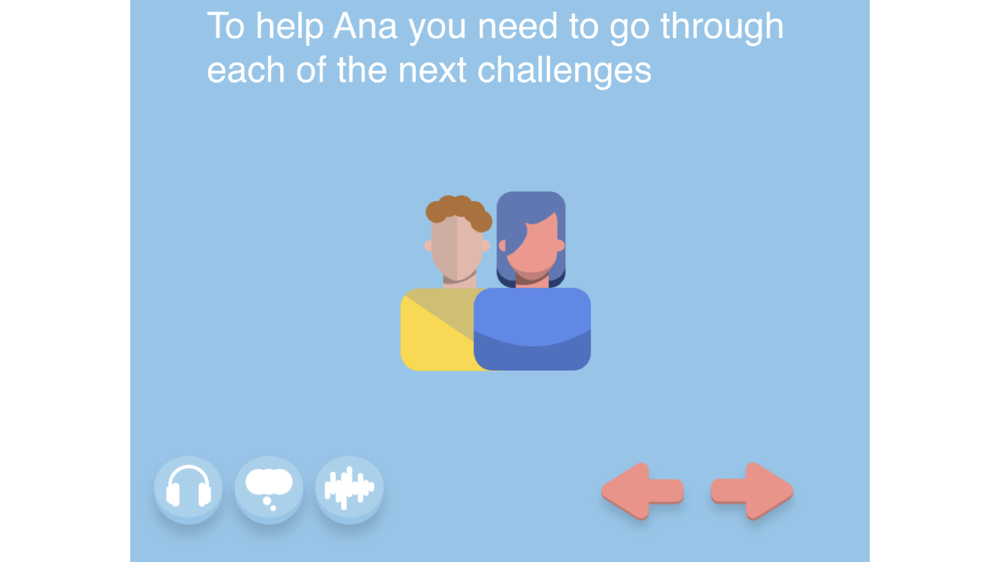
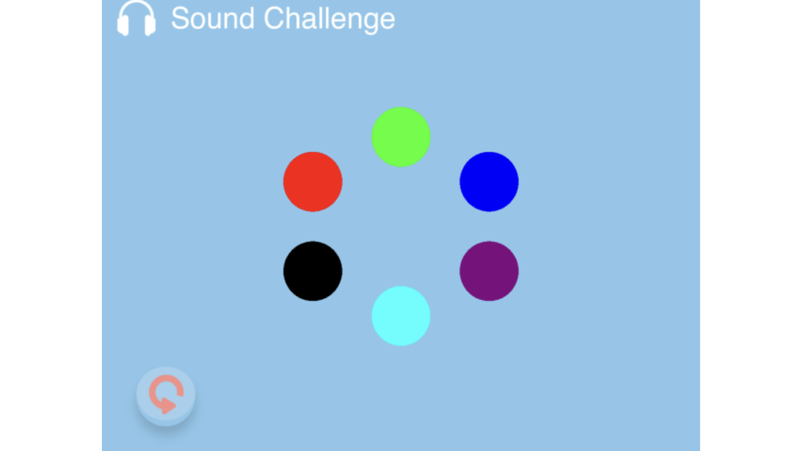
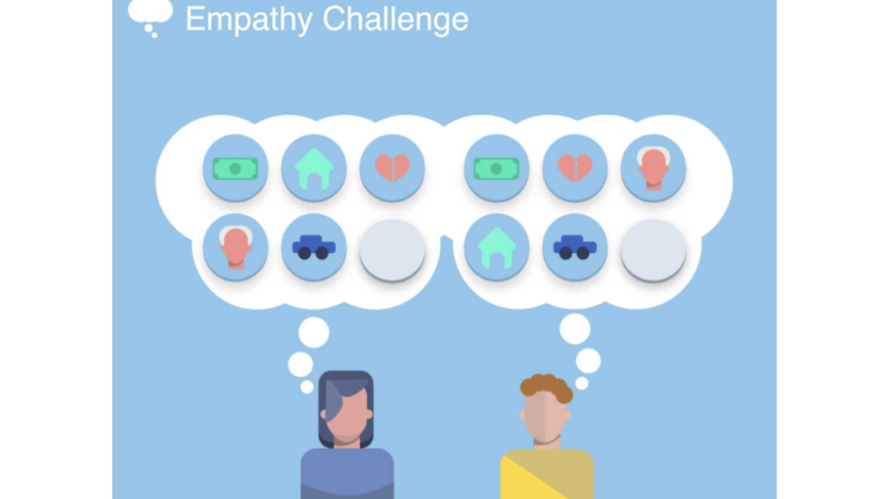
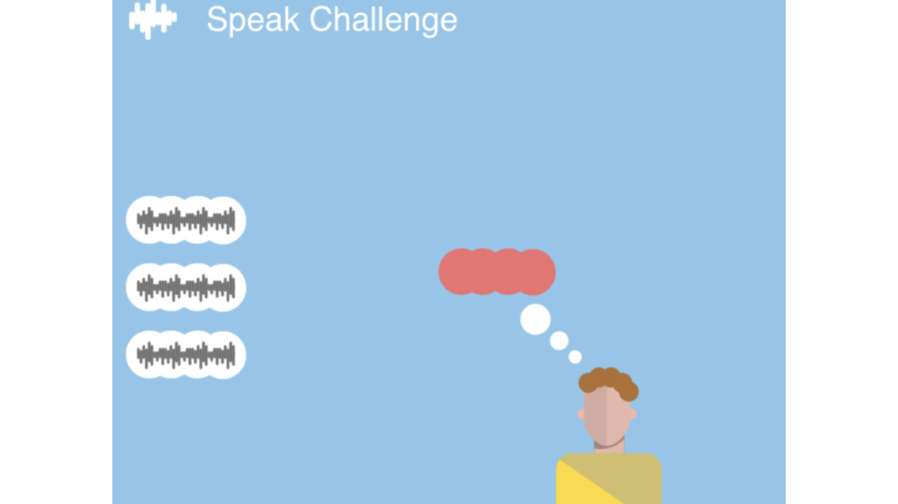

# WWDC_EmpathyChallenge

### About My Project

The Empathy Challenge  is a scene in which the user is led to develop three characteristics of empathy: listening, putting oneself in the other's shoes and speaking. Each of these features is represented by means of puzzles. In the end the user will be able to help the character Ana, who was a little sad but now knows that there is someone who understands her a little better.

Click **[ here ](https://www.youtube.com/watch?v=8C5BjjiLf5Y&t=5s)** to watch the video.

### **WWDC2020 Swift Student Challenge Winner**

### Screenshots

]

]

]

]
